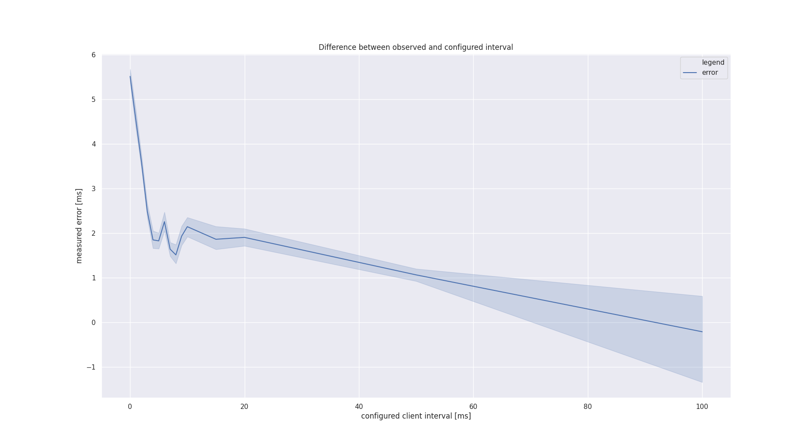
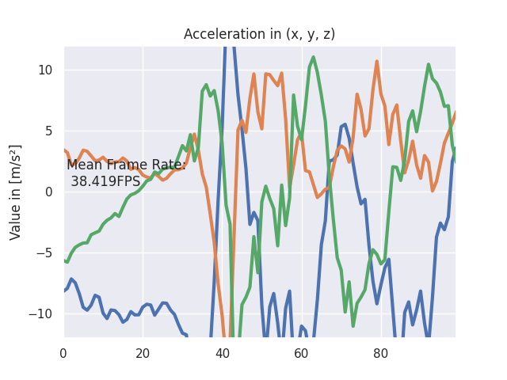
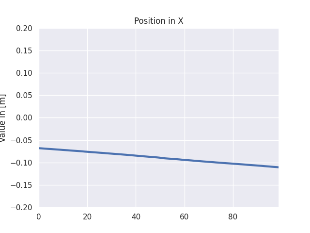
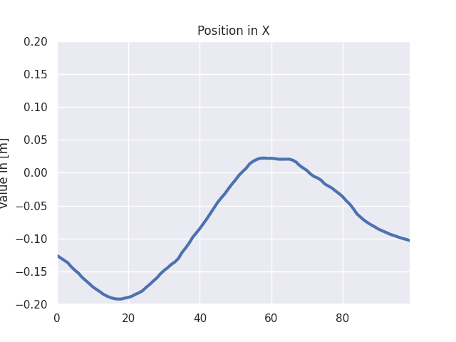
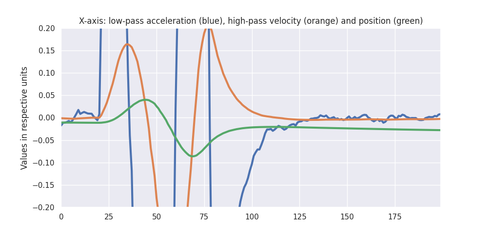

# phone-imu, a student project for data fusion

This code declares a webserver to run on your computer. Open the page on your mobile device to stream IMU data back to the host. Use this data to calculate the device relative position, orientation, etc.

## Project description

[Inertial Measurement Units]((https://en.wikipedia.org/wiki/Inertial_measurement_unit)) (IMUs) are used everywhere; in planes, autonomous vehicles, submarines, smart watches, computers ... and your mobile phone. They are general purpose modules constructor add to products everytime position, orientation, speed or motion capture is necessary. As future engineers, you ought to be able to interact with the typical sensor and present results in nice visualisation. From my experience at AKKA Technologies, demonstrating your involvement in projects mixing low level data, physics and software would help you get hired pretty fast !

Some examples using IMUs are :

- All autonomous cars use an IMU, see Apollo 2 ([link to specs](https://github.com/ApolloAuto/apollo/blob/master/docs/quickstart/apollo_2_0_hardware_system_installation_guide_v1.md#key-hardware-components))
- Open Source Autonomous Driving projects such as Autoware use some ([link](https://gitlab.com/autowarefoundation/autoware.ai/autoware/-/wikis/home))
- Robotics manufacturer ([example](https://www.ceva-dsp.com/app/motion-sensing/))
- IMUs price go from a 2€ (like a [MPU-6050](https://invensense.tdk.com/products/motion-tracking/6-axis/mpu-6050/)) to 20€ (like a [BNO080](https://github.com/jps2000/BNO080)) to ks€ (see GPS-RTK) !!


But where will we find an IMU for each student, and that you already have at home (#stayhome) ? Thankfully your smartphones have good IMUs, so let's push them at their maximum and find out how good they are. What works for the phones will work for Autonomous Vehicles as well.

We will stream the phone accelerometer and gyroscope data to the computer and experiment with data fusion. Beneath is what high level sensor fusion looks like ([source](https://github.com/koide3/hdl_graph_slam)), so keep up !
 

### Description

We will turn the internal accelerometer, gyroscope and magnetometer in an Inertial Measurement Unit as an introduction to robotics.
You will be measuring the relative position of your device through sensor fusion and use it to measure distances at home.

## Deliverables

### Timetable

L3: 10 Apr 8.30-11.45 (NOTE SAME DAY TWO LECTURES!)

L4: 10 Apr 13.30-15.30

L5: 24 April 13.30-15.30

L6: 15 May 13.30-15.30

L7: 18 May 8.30-11.45

L8: 22 May 13.30-15.30 EXAM

### Instruction

Objective: run the code, handle the data and write `test_imu.TestImu.test_mean_data`.

Preparations:

1. Join the telegram chat (link on moodle)
1. Create a private repository named IN104_Project_Name_Name
1. Invite me as contributor (on gitlab, maintainer)
1. Clone your repository on your computer
1. Add my repo as a new remote `git remote add teacher https://github.com/vtalpaert/phone-imu`
1. List your remotes for verification `git remote -v`, you should see `origin` and `teacher`
1. Pull my code `git pull teacher master`
1. In case your repo was not empty, merge incoming commits
1. Create environment using the install instructions below

### First deliverable

Deadline April 16th. In `imu.py`, change the method `run` to :

1. calculate mean over last 100 values (use get_first_data in this case). Tip: try `deque`, the same as `list` but with fixed length

    ```python
    >>> import collections
    >>> help(collections.deque)
    ```

1. calculate mean and std of time difference between two samples (with get_first_data as well). Tip: Define a `mean` function for clearer code, it will use the built-ins `sum` and `len`
1. explain the difference between taking the mean every hundred values ('slow average'), and updating the mean at each value ('running average'). Bonus, try other smoothing functions than the mean. See bellow for example.

Example of the plot to include in your report :


To plot this, you can use my first function from `draw.py`.

How to submit homework :

1. Write some code
1. Commit and push to your repo
1. Your teammate pulls your modifications
1. Your teammate writes some code as well
1. Your teammate pushes his code
1. You pull his code
1. When your code completes the mean of 100 values, comment your last commit on github with a sample of the output and tag me (@vtalpaert)
1. Same when you did the mean time difference

### Second deliverable

Deadline April 23rd.

Control time !

1. Pull and merge the latest changes from my repo `git pull teacher master`.
1. Is there an error ? Read carefully the git output, if there is a merge conflict, this is a normal and expected error. You must manually correct the conflicting files before commiting the merge
1. Are there new requirements ? `pip3 install -r requirements.txt` again.
1. Write a test for calculating the mean on a data list, put it in `test_imu.TestImu.test_mean_data`
1. Speed up your code ! In `imu.py` class `IMU`, change `thread_update_delay` to `0.01` or `0.1`. Now measure the new effective time delay using what you did last week. Comment your results on the commits. Does it change something when you use `get_first_data` ? With `get_last_data` ? Why ?
1. Now change `client_send_interval`. Change the interval length to 1 millisecond, try 0 as well. What happens ?
1. (The refresh rate question does not apply anymore since I removed the separate thread, I you want to go back to this question and the `thread.py` code, use `git checkout b3128338f84efb6c3845586d089fd797e08f7433` then `git checkout -b thread-question`. Don't forget to push this new branch as well if you want me to see it)
1. Now we want to run the computer side code as fast as possible, so we will keep `thread_update_delay = 0.01`. Use now only `client_send_interval` and measure the mean delta between two data pieces. Include in your report a table with different intervals (between 0 and 50ms), the mean delta and standard deviation
1. Add to your report a plot that looks like this:

    

    You can use the second function from the current `draw.py`. It will take care of the mean and std by itself. I used 500 measures for each interval in `[100, 50, 20, 15, 10, 9, 8, 7, 6, 5, 4, 3, 2, 1, 0]`. For me, 20 milliseconds seems the most stable settings. Tip: you need the same exact number of measures at each index (500 values for each interval) for the draw function to work.

### Third deliverable

Deadline May 5th, 2020.

Control space !

For your convenience, I added a live plotting tool in `draw.py`, here is me plotting 100 acceleration raw values in X, Y, and Z. Keep in mind that plotting slows your code down, so you may only call `live_plot.draw()` every 10 iterations for example. Tip: use the disk button to save a clean picture, the graph will not update in the meantime.
(To reset the code at this example, use `git checkout 783955fceae81eee06b19614b81640a66529daa3`)



We will now try to find the position of the device on one axis. As you can guess, using the acceleration we should in theory be able to calculate the position, but in practice this won't work. Let's experience first hand exactly what is happening with the following instructions, and keep our observations in our final report.

1. Intialize the IMU with a position and velocity of 0s. Keep your device on a table or any plane surface.
1. Visualize the acceleration, and find your X-axis by moving the phone. How does the acceleration change over time ? Is it centered on zero when immobile ? If you slightly tilt the device, is it centered on another value ? Why is the acceleration non-zero ? (Write the answers in your report)
1. Calculate the `delta_t` the difference in two samples. For me it was not exactly my `client_send_interval` value of 20ms, but rather 21.5ms.
1. In the IMU `run` function, use the acceleration to update the position. If you integrate the acceleration over time, you get a velocity, do it a second time and you get the relative position. I used the formula `delta_p = v * delta_t + 0.5 * a * delta_t ** 2`
When I did it, the position would drift linearly after a very short time even if the device was not moving, see my example :

By carefully moving the phone in a translation along the X-axis for around 20cm, then back to the initial position and so forth, I got :

Include your own version of this plot in your report.
1. The first problem to solve, if that the acceleration is not necessarily centered on zero. Correct the raw value by substracting a base value. This is where your mean function may come in handy. This is loosely equivalent to using a high-pass filter if your mean is recalculated over time (so `filtered = raw - mean`)
1. Then get rid of the noise in the acceleration with a low pass filter. If you look at the very first image on this page, you see that taking the mean is a low pass (orange vs blue). Tip : you can also update a value using `current_value = 0.1 * observed_value + 0.9 * current_value` for slow changes.
1. Plot the raw acceleration, high-pass, low-pass and combined low and high pass values. Experiment different parameters in your filters and explain what worked best for you.
1. With the two filters on the acceleration, I moved the phone to the left, to the right and back at the start position. I calculated the velocity and position to be :

For cleaning the velocity value, I made the assumption it would (very) slowly go back to zero over time (again, equivalent to a high pass).
Furthermore, only specific values of acceleration are taking into account due to the cutoff frequencies of my combined filters. Looking at the orange/velocity and green/position lines, you can verify the velocity is null when the position is at a maximum. This is the kind of plot you must include in your report for this deliverable.

That's it for the homework. Keep in mind the drift is bound to happen whatever you try, so you will need to restart the calculations quite often. Finding the right parameters in your filters is crucial. In the end, the parameters will work for a specific motion (in my case: 0cm, +20cm, -20cm, 0cm in approx 3 seconds). So find one you like and stick to it while tuning your parameters.

### Fourth deliverable

### etc

Task 1 dimension : basic ruler

Task 2 dimensions : circular movement

Task 3 dimensions : free displacement

### Last deliverable

Final presentations

#### How to write your report

Will come soon

## Install and run

1. Create a python environment, with Anaconda or Virtual Env. With Anaconda, use for example `conda create -n imu python=3.7`
1. Source your env. With Anaconda, use `conda activate imu`
1. Verify you are using Python 3 : `python --version`
1. Install dependencies `pip install -r requirements.txt`, read the output to check everything went well
1. Note your local IP address, such as `192.168.1.64` for me. On linux, use `ifconfig`
1. Run tests with `python -m unittest`
1. Run server with `python server.py`. Pro tip: you can stop the script with `Ctrl-C`
1. On your device, open the address `192.168.1.64:5000` to visit the server homepage
1. On some browser, the timestamp has a reduced precision ([explanation](https://developer.mozilla.org/en-US/docs/Web/JavaScript/Reference/Global_Objects/Date/now)), on Firefox you need for example to disable `privacy.reduceTimerPrecision` in `about:config`

### Common issues

- `socket.error: [Errno 98] Address already in use` means another flask instance is still running. Restart your terminal or type `fuser 5000/tcp -k` (might need a sudo) for linux ([source](https://stackoverflow.com/questions/41393384/flask-running-issue-socket-error-errno-98-address-already-in-use))

## Sources

- FlaskIO documentation and [example](https://github.com/miguelgrinberg/Flask-SocketIO/tree/master/example)
- Device motion capture [reference](https://whatwebcando.today/device-motion.html)
