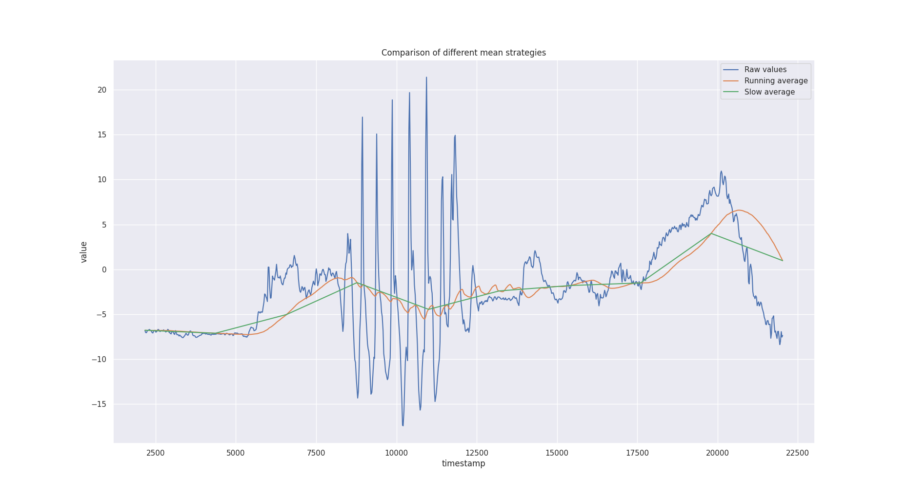

# phone-imu, a student project for data fusion

This code declares a webserver to run on your computer. Open the page on your mobile device to stream IMU data back to the host. Use this data to calculate the device relative position, orientation, etc.

## Project description

[Inertial Measurement Units]((https://en.wikipedia.org/wiki/Inertial_measurement_unit)) (IMUs) are used everywhere; in planes, autonomous vehicles, submarines, smart watches, computers ... and your mobile phone. They are general purpose modules constructor add to products everytime position, orientation, speed or motion capture is necessary. As future engineers, you ought to be able to interact with the typical sensor and present results in nice visualisation. From my experience at AKKA Technologies, demonstrating your involvement in projects mixing low level data, physics and software would help you get hired pretty fast !

Some examples using IMUs are :

- All autonomous cars use an IMU, see Apollo 2 ([link to specs](https://github.com/ApolloAuto/apollo/blob/master/docs/quickstart/apollo_2_0_hardware_system_installation_guide_v1.md#key-hardware-components))
- Open Source Autonomous Driving projects such as Autoware use some ([link](https://gitlab.com/autowarefoundation/autoware.ai/autoware/-/wikis/home))
- Robotics manufacturer ([example](https://www.ceva-dsp.com/app/motion-sensing/))
- IMUs price go from a 2€ (like a [MPU-6050](https://invensense.tdk.com/products/motion-tracking/6-axis/mpu-6050/)) to 20€ (like a [BNO080](https://github.com/jps2000/BNO080)) to ks€ (see GPS-RTK) !!


But where will we find an IMU for each student, and that you already have at home (#stayhome) ? Thankfully your smartphones have good IMUs, so let's push them at their maximum and find out how good they are. What works for the phones will work for Autonomous Vehicles as well.

We will stream the phone accelerometer and gyroscope data to the computer and experiment with data fusion. Beneath is what high level sensor fusion looks like ([source](https://github.com/koide3/hdl_graph_slam)), so keep up !
 

### Description

We will turn the internal accelerometer, gyroscope and magnetometer in an Inertial Measurement Unit as an introduction to robotics.
You will be measuring the relative position of your device through sensor fusion and use it to measure distances at home.
The difficulty will go crescendo with different tasks :
Task 0 dimension : the compass
Measure the device absolute orientation by using both the angular velocity and the magnetometer.

### Task 1 dimension : basic ruler

Move your device on a flat surface like a table and measure its length. You can easily experimentally verify using an IRL ruler.

### Task 2 dimensions : circular movement

On a flat surface, move your device randomly and back to the original position. Is your error within a few centimeters ? You got it !

### Task 3 dimensions : free displacement

The hardest task. Move your IMU freely and randomly in space to measure distances, or go back to the original position and observe the error.

## Deliverables

### Timetable

L3: 10 Apr 8.30-11.45 (NOTE SAME DAY TWO LECTURES!)

L4: 10 Apr 13.30-15.30

L5: 24 April 13.30-15.30

L6: 15 May 13.30-15.30

L7: 18 May 8.30-11.45

L8: 22 May 13.30-15.30

### Session 1 : Lecture 4

Objective: run the code, handle the data and write `test_imu.TestImu.test_mean_data`.

#### Instructions

Preparations:

1. Join the telegram chat (link on moodle)
1. Create a private repository named IN104_Project_Name_Name
1. Invite me as contributor (on gitlab, maintainer)
1. Clone your repository on your computer
1. Add my repo as a new remote `git remote add teacher https://github.com/vtalpaert/phone-imu`
1. List your remotes for verification `git remote -v`, you should see `origin` and `teacher`
1. Pull my code `git pull teacher master`
1. In case your repo was not empty, merge incoming commits
1. Create environment using the install instructions below

#### First deliverable

Deadline April 16th. In `imu.py`, change the method `run` to :

1. calculate mean over last 100 values (use get_first_data in this case). Tip: try `deque`, the same as `list` but with fixed length

    ```python
    >>> import collections
    >>> help(collections.deque)
    ```

1. calculate mean and std of time difference between two samples (with get_first_data as well). Tip: Define a `mean` function for clearer code, it will use the built-ins `sum` and `len`
1. explain the difference between taking the mean every hundred values ('slow average'), and updating the mean at each value ('running average'). Bonus, try other smoothing functions than the mean.

Example of different mean strategies :



How to submit homework :

1. Write some code
1. Commit and push to your repo
1. Your teammate pulls your modifications
1. Your teammate writes some code as well
1. Your teammate pushes his code
1. You pull his code
1. When your code completes the mean of 100 values, comment your last commit on github with a sample of the output and tag me (@vtalpaert)
1. Same when you did the mean time difference

#### Second deliverable

Deadline April 23rd.

Control time !

1. Pull the latest changes from my repo `git pull teacher master`.
1. Are there new requirements ? `pip3 install -r requirements.txt` again.
1. Write a test for calculating the mean on a data list, put it in `test_imu.TestImu.test_mean_data`
1. Speed up your code ! In `imu.py` class `IMU`, change `update_rate` to 0. Now measure the new effective time delay using what you did last week. Comment your results on the commits.
1. In `index.html` line 47. Change the interval length to 1 millisecond, try 0 as well. What happens ?
1. Control the refresh rate of your code. Set a new non zero `update_rate`, but you can see the std of the time delay is not 0 (if it is 0, then reduce the `update_rate` again). Comment on a commit the new measured delay.
. The reason is because in `threads.py` you have more or less :

    ```python
    self.parent.run()  # might take a few milliseconds, lets say x seconds
    time.sleep(self.delay)  # sleeps for update_rate seconds
    ```

    so the refresh rate is `x + update_rate`. Change `threads.py` to not use `time.sleep` but instead use `time.time()`. In a loop note the start time, execute `parent.run` one time and then run a `while` loop as long as necessary :

    ```python
    start = time.time()  # write down start time
    self.parent.run()  # do run() once
    while is_it_time_to_move_on? :  # replace this
        pass  # do nothing, test again if time to move on
    ```

1. Can you think of a test for this ?

Control space !

1. Intialize the IMU with a position at x=y=z=0
1. In the IMU `run` function, use the acceleration to update to position by using the displacement. If you integrate the acceleration over time, you get a velocity, do it a second time and you get the relative position.
1. Add a method to IMU to return the current position. Write a test for this.

Start you final report and write down if calculating the position from the acceleration works. Why or why not ?
calculate

### Session 2 : Lecture 5

Task 1 dimension : basic ruler

### Session 3 : Lecture 6

Task 2 dimensions : circular movement

### Session 4 : Lecture 7

Task 3 dimensions : free displacement

### Session 5 : Lecture 8

Final presentations

#### How to write your report

Will come soon

## Install and run

1. Create a python environment, with Anaconda or Virtual Env. With Anaconda, use for example `conda create -n imu python=3.7`
1. Source your env. With Anaconda, use `conda activate imu`
1. Verify you are using Python 3 : `python --version`
1. Install dependencies `pip install -r requirements.txt`, read the output to check everything went well
1. Note your local IP address, such as `192.168.1.64` for me. On linux, use `ifconfig`
1. Run tests with `python -m unittest`
1. Run server with `python server.py`. Pro tip: you can stop the script with `Ctrl-C`
1. On your device, open the address `192.168.1.64:5000` to visit the server homepage
1. On some browser, the timestamp has a reduced precision ([explanation](https://developer.mozilla.org/en-US/docs/Web/JavaScript/Reference/Global_Objects/Date/now)), on Firefox you need for example to disable `privacy.reduceTimerPrecision` in `about:config`

### Common issues

- `socket.error: [Errno 98] Address already in use` means another flask instance is still running. Restart your terminal or type `fuser 5000/tcp -k` (might need a sudo) for linux ([source](https://stackoverflow.com/questions/41393384/flask-running-issue-socket-error-errno-98-address-already-in-use))

## Sources

- FlaskIO documentation and [example](https://github.com/miguelgrinberg/Flask-SocketIO/tree/master/example)
- Device motion capture [reference](https://whatwebcando.today/device-motion.html)
